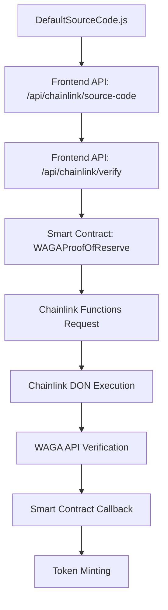

# WAGA Coffee: Chainlink Functions Source Code Flow

## Overview

This document explains how the default source code is handled for coffee batch verifications in the WAGA Coffee Traceability System. The system uses Chainlink Functions to create a decentralized verification process that validates physical coffee inventory before minting tokens.

## Architecture Overview



## 1. Source Code Storage

**Location**: `/Users/manu-acho/foundry_2/WAGA_MVP_V2/DefaultSourceCode.js`

**Purpose**: Contains the JavaScript code that will be executed by Chainlink oracle nodes to verify coffee batch inventory.

**Key Features**:
- Validates 5 input arguments: `[batchId, expectedQuantity, expectedPrice, expectedPackaging, expectedMetadataHash]`
- Makes HTTP requests to WAGA API endpoints for inventory verification
- Performs metadata integrity checks
- Returns ABI-encoded response: `(uint256 quantity, uint256 price, string packaging, string metadataHash)`

**Code Structure**:
```javascript
// Argument validation
if (!args || args.length < 5) {
  throw Error("Missing required arguments");
}

// Extract arguments
const batchId = args[0];
const expectedQuantity = parseInt(args[1]);
const expectedPrice = parseInt(args[2]);
const expectedPackaging = args[3];
const expectedMetadataHash = args[4];

// API calls for verification
const inventoryApiUrl = `https://api.wagacoffee.com/inventory/batch/${batchId}`;
const inventoryRequest = Functions.makeHttpRequest({
  url: inventoryApiUrl,
  method: "GET",
  headers: {
    "Authorization": `Bearer ${secrets.WAGA_API_KEY}`,
    "Content-Type": "application/json"
  }
});

// Return encoded response
return Functions.encodeUint256(verifiedQuantity) +
       Functions.encodeUint256(verifiedPrice) +
       Functions.encodeString(verifiedPackaging) +
       Functions.encodeString(verifiedMetadataHash);
```

## 2. Frontend API Layer

### 2.1 Source Code Endpoint: `/api/chainlink/source-code`

**File**: `frontend/app/api/chainlink/source-code/route.ts`

**Responsibilities**:
- Reads `DefaultSourceCode.js` from the project root
- Replaces placeholder URLs with actual API endpoints
- Adds environment-specific configurations
- Returns processed source code to requesting services

**Implementation**:
```typescript
export async function GET() {
  try {
    // Read the default source code file
    const sourceCodePath = join(process.cwd(), '../DefaultSourceCode.js');
    let sourceCode = readFileSync(sourceCodePath, 'utf8');

    // Replace placeholder URLs with production URLs
    sourceCode = sourceCode
      .replace('https://api.wagacoffee.com/inventory/batch/', 
               `${process.env.NEXT_PUBLIC_API_BASE_URL}/api/batches/`)
      .replace('https://api.wagacoffee.com/metadata/verify/', 
               `${process.env.NEXT_PUBLIC_API_BASE_URL}/api/batches/pin-status?cid=`);

    // Add Ethiopian coffee specific validation
    const productionSourceCode = sourceCode + `
    // Additional validation for Ethiopian coffee batches
    if (verifiedPackaging !== "250g" && verifiedPackaging !== "500g") {
      throw Error("Invalid packaging for Ethiopian coffee batch");
    }`;

    return NextResponse.json({ 
      sourceCode: productionSourceCode,
      version: "1.0.0-ethiopian-coffee",
      lastUpdated: new Date().toISOString()
    });
  } catch (error) {
    // Fallback source code if file read fails
    return fallbackSourceCode();
  }
}
```

### 2.2 Verification Endpoint: `/api/chainlink/verify`

**File**: `frontend/app/api/chainlink/verify/route.ts`

**Responsibilities**:
- Receives verification requests from the frontend
- Fetches processed source code from `/api/chainlink/source-code`
- Validates batch existence
- Prepares data for smart contract interaction
- Returns request ID and status

**Flow**:
```typescript
export async function POST(request: NextRequest) {
  const { batchId, recipient, verificationType } = await request.json();

  // 1. Get the source code from the source-code endpoint
  const sourceCodeResponse = await fetch(`${process.env.NEXT_PUBLIC_API_BASE_URL}/api/chainlink/source-code`);
  const { sourceCode } = await sourceCodeResponse.json();

  // 2. Verify the batch exists
  const batchResponse = await fetch(`${process.env.NEXT_PUBLIC_API_BASE_URL}/api/batches/${batchId}`);

  // 3. Prepare verification request data
  const verificationData = {
    batchId,
    sourceCode,  // ← Source code passed here
    recipient,
    verificationType,
    contractAddresses: { /* contract addresses */ },
    chainlinkConfig: { /* chainlink configuration */ }
  };

  // 4. In production: Call smart contract with sourceCode
  // const contractResponse = await contract.requestReserveVerification(batchId, recipient, sourceCode);

  return NextResponse.json({ success: true, requestId, verificationData });
}
```

## 3. Smart Contract Integration

### 3.1 WAGAProofOfReserve Contract

**File**: `src/WAGAProofOfReserve.sol`

**Key Functions**:

#### Request Reserve Verification
```solidity
function requestReserveVerification(
    uint256 batchId,
    address recipient,
    string calldata source  // ← JavaScript source code passed as parameter
) external returns (bytes32 requestId) {
    
    // 1. Get expected values from WAGACoffeeToken
    (,,,uint256 requestQuantity, uint256 requestPrice, 
     string memory expectedPackaging, string memory expectedMetadataHash,,) = 
     coffeeToken.s_batchInfo(batchId);
    
    // 2. Prepare arguments for Chainlink Functions
    string[] memory args = new string[](5);
    args[0] = Strings.toString(batchId);           // args[0] in JavaScript
    args[1] = Strings.toString(requestQuantity);   // args[1] in JavaScript 
    args[2] = Strings.toString(requestPrice);      // args[2] in JavaScript
    args[3] = expectedPackaging;                   // args[3] in JavaScript
    args[4] = expectedMetadataHash;               // args[4] in JavaScript
    
    // 3. Convert source code to bytes and send request
    bytes memory sourceBytes = bytes(source);
    requestId = _sendRequestWithArgs(
        sourceBytes,  // ← Source code embedded in request
        args,         // ← Arguments for the JavaScript execution
        subscriptionId, 
        300000,       // Gas limit
        donId
    );
    
    // 4. Store verification request
    verificationRequests[requestId] = VerificationRequest({
        batchId: batchId,
        recipient: recipient,
        // ... other fields
    });
    
    return requestId;
}
```

#### Request Inventory Verification (No Minting)
```solidity
function requestInventoryVerification(
    uint256 batchId,
    string calldata source
) external returns (bytes32 requestId) {
    // Similar flow but with shouldMint = false
    // Used for periodic inventory checks without token minting
}
```

### 3.2 WAGAChainlinkFunctionsBase Contract

**File**: `src/WAGAChainlinkFunctionsBase.sol`

**Key Function - Source Code Transmission**:
```solidity
function _sendRequestWithArgs(
    bytes memory source,      // ← JavaScript source code as bytes
    string[] memory args,     // ← Arguments for JavaScript execution
    uint64 _subscriptionId,
    uint32 gasLimit,
    bytes32 _donId
) internal returns (bytes32 requestId) {
    
    FunctionsRequest.Request memory req;
    
    // Initialize request with inline JavaScript source code
    req.initializeRequestForInlineJavaScript(string(source)); // ← Critical line
    
    // Attach arguments that will be available as 'args' array in JavaScript
    if (args.length > 0) {
        req.setArgs(args);  // ← Arguments become args[0], args[1], etc.
    }
    
    // Encode and send request to Chainlink Functions
    return _sendRequest(req.encodeCBOR(), _subscriptionId, gasLimit, _donId);
}
```

## 4. Chainlink Functions Execution

### 4.1 Request Processing

When the smart contract sends the request:

1. **Validation**: Chainlink validates the subscription and DON configuration
2. **Distribution**: Request is distributed to multiple oracle nodes in the DON
3. **Execution**: Each node runs the JavaScript source code with the provided arguments
4. **Consensus**: Nodes reach consensus on the response
5. **Callback**: Aggregated response is sent back to the smart contract

### 4.2 JavaScript Execution Environment

The source code runs with:
- **`args`**: Array containing `[batchId, quantity, price, packaging, metadataHash]`
- **`secrets`**: Encrypted secrets like API keys
- **`Functions`**: Chainlink Functions library for HTTP requests and encoding

**Example execution**:
```javascript
// args[0] = "2025000001"     (batchId)
// args[1] = "100"            (expectedQuantity)
// args[2] = "25"             (expectedPrice)  
// args[3] = "250g"           (expectedPackaging)
// args[4] = "metadataHash123" (expectedMetadataHash)

const inventoryRequest = Functions.makeHttpRequest({
  url: `https://your-api.com/api/batches/2025000001`,
  method: "GET",
  headers: {
    "Authorization": `Bearer ${secrets.WAGA_API_KEY}`,
    "Content-Type": "application/json"
  }
});

const response = await inventoryRequest;
// Validate response against expected values...
// Return encoded results
```

## 5. Response Processing

### 5.1 Smart Contract Callback

**Function**: `_fulfillRequest` in WAGAProofOfReserve

```solidity
function _fulfillRequest(
    bytes32 requestId,
    bytes memory response,  // ← ABI-encoded response from JavaScript
    bytes memory err        // ← Any errors from JavaScript execution
) internal override {
    
    VerificationRequest storage request = verificationRequests[requestId];
    
    // 1. Handle errors first
    if (err.length > 0) {
        request.completed = true;
        request.verified = false;
        emit ReserveVerificationCompleted(requestId, request.batchId, false);
        return;
    }
    
    // 2. Parse successful response
    (uint256 verifiedQuantity, uint256 verifiedPrice, 
     string memory verifiedPackaging, string memory verifiedMetadataHash) = 
     _parseResponse(response);
    
    // 3. Update batch metadata in WAGACoffeeToken
    coffeeToken.verifyBatchMetadata(
        request.batchId, 
        verifiedPrice, 
        verifiedPackaging, 
        verifiedMetadataHash
    );
    
    // 4. Validate quantities
    if (verifiedQuantity < request.requestQuantity) {
        revert WAGAProofOfReserve__QuantityNotVerified_fulfillRequest();
    }
    
    // 5. Update request status
    request.completed = true;
    request.verified = true;
    request.lastVerifiedTimestamp = block.timestamp;
    
    // 6. Update token contract state
    coffeeToken.updateBatchLastVerifiedTimestamp(request.batchId, block.timestamp);
    coffeeToken.updateInventory(request.batchId, verifiedQuantity);
    coffeeToken.updateBatchStatus(request.batchId, true);
    
    // 7. Mint tokens if requested (for reserve verification)
    if (request.shouldMint) {
        coffeeToken.mintBatch(
            request.recipient, 
            request.batchId, 
            request.verifiedQuantity
        );
    }
    
    emit ReserveVerificationCompleted(requestId, request.batchId, true);
}
```

### 5.2 Response Parsing

```solidity
function _parseResponse(bytes memory response) internal pure returns (
    uint256 verifiedQuantity,
    uint256 price,
    string memory packaging,
    string memory metadataHash
) {
    if (response.length == 0) {
        return (0, 0, "", "");
    }
    
    // Decode ABI-encoded response from JavaScript
    (verifiedQuantity, price, packaging, metadataHash) = 
        abi.decode(response, (uint256, uint256, string, string));
}
```

## 6. Frontend User Interface

### 6.1 ChainlinkVerification Component

**File**: `frontend/app/components/ChainlinkVerification.tsx`

**User Actions**:
- **"Verify Inventory"**: Calls `requestInventoryVerification` (no minting)
- **"Verify & Mint Tokens"**: Calls `requestReserveVerification` (with minting)

**Flow**:
```typescript
const triggerVerification = async (verificationType: 'reserve' | 'inventory') => {
  // 1. Call verification API
  const response = await fetch('/api/chainlink/verify', {
    method: 'POST',
    body: JSON.stringify({
      batchId,
      verificationType,
      recipient: verificationType === 'reserve' ? walletAddress : null
    })
  });

  const data = await response.json();
  setRequestId(data.requestId);
  
  // 2. Start polling for status updates
  pollVerificationStatus(data.requestId);
};
```

### 6.2 Status Polling

```typescript
const pollVerificationStatus = async (reqId: string) => {
  const pollInterval = setInterval(async () => {
    const response = await fetch(`/api/chainlink/status/${reqId}`);
    const statusData = await response.json();

    if (statusData.status === 'fulfilled') {
      setResult(statusData.result);
      setStatus('completed');
      clearInterval(pollInterval);
      onVerificationComplete?.(statusData.result);
    } else if (statusData.status === 'failed') {
      setError(statusData.error);
      setStatus('failed');
      clearInterval(pollInterval);
    }
  }, 5000); // Poll every 5 seconds
};
```

## 7. Complete Data Flow Summary

### 7.1 Source Code Journey

```
DefaultSourceCode.js 
    ↓ (readFileSync)
/api/chainlink/source-code 
    ↓ (URL replacement & processing)
/api/chainlink/verify 
    ↓ (fetch source code)
WAGAProofOfReserve.requestReserveVerification()
    ↓ (string calldata source parameter)
WAGAChainlinkFunctionsBase._sendRequestWithArgs()
    ↓ (req.initializeRequestForInlineJavaScript(string(source)))
Chainlink Functions Request
    ↓ (distributed to DON)
Oracle Node JavaScript Execution
    ↓ (HTTP requests to WAGA API)
Consensus & Response
    ↓ (ABI-encoded response)
WAGAProofOfReserve._fulfillRequest()
    ↓ (parse response & update state)
WAGACoffeeToken.mintBatch()
```

### 7.2 Arguments Flow

```
WAGACoffeeToken.s_batchInfo(batchId)
    ↓ (extract expected values)
string[] memory args = [batchId, quantity, price, packaging, metadataHash]
    ↓ (req.setArgs(args))
Chainlink Functions Request
    ↓ (args array available in JavaScript)
JavaScript Execution: args[0], args[1], args[2], args[3], args[4]
    ↓ (validation against API responses)
Encoded Response: (quantity, price, packaging, metadataHash)
    ↓ (abi.decode in smart contract)
Token Minting & State Updates
```

## 8. Key Benefits

1. **Decentralization**: Multiple oracle nodes verify inventory independently
2. **Transparency**: Source code is embedded in blockchain transactions
3. **Flexibility**: Source code can be updated for different verification requirements
4. **Security**: Cryptographic proofs ensure data integrity
5. **Scalability**: Same system works for any number of coffee batches

## 9. Production Considerations

### 9.1 Security
- Source code is publicly visible on-chain
- Sensitive operations should use encrypted secrets
- Input validation is critical

### 9.2 Cost Optimization
- Gas limit optimization for source code size
- Efficient API endpoints to reduce execution time
- Proper error handling to avoid failed requests

### 9.3 Monitoring
- Request ID tracking for debugging
- Status polling for user experience
- Error logging for system maintenance

This architecture creates a trustless, decentralized system for verifying physical coffee inventory before minting digital tokens, ensuring that every token is backed by real, verified coffee reserves.
