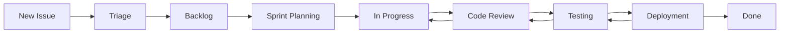

# 📊 **GitHub Projects Board Setup - WAGA Coffee Platform**

## 🎯 **Implementation Steps for GitHub Projects**

This guide walks you through setting up comprehensive project management boards for the WAGA Coffee Platform using GitHub Projects.

---

## 📋 **Step 1: Create Main Development Board**

### **Board Configuration:**
- **Name**: `WAGA Coffee MVP Development`
- **Type**: Board (Kanban-style)
- **Visibility**: Private (team access only)

### **Column Setup:**
```
📋 Backlog       🔄 In Progress     👀 In Review      ✅ Done
🐛 Bug Fixes     🧪 Testing        📦 Deployment     🔄 Blocked
```

### **Column Descriptions:**
- **📋 Backlog**: New issues awaiting triage and planning
- **🔄 In Progress**: Currently being worked on (max 3 per person)
- **👀 In Review**: Code review and QA testing phase
- **✅ Done**: Completed and deployed tasks
- **🐛 Bug Fixes**: Critical bugs requiring immediate attention
- **🧪 Testing**: Items in testing phase (unit/integration/E2E)
- **📦 Deployment**: Ready for deployment or recently deployed
- **🔄 Blocked**: Items waiting on dependencies or external factors

### **Board Views:**
1. **Sprint View**: Filter by current milestone
2. **Team View**: Group by assignee
3. **Component View**: Group by label (smart-contracts, frontend, zk-proofs)
4. **Priority View**: Sort by priority labels

---

## 📊 **Step 2: Create Feature Roadmap (Table View)**

### **Table Configuration:**
- **Name**: `WAGA Coffee Feature Roadmap`
- **Type**: Table
- **Purpose**: Track features across development phases

### **Field Configuration:**

#### **Required Fields:**
| Field Name | Type | Options | Description |
|------------|------|---------|-------------|
| **Title** | Text | - | Feature or task name |
| **Phase** | Select | Phase 1, Phase 2, Phase 3, Future | Development phase |
| **Status** | Select | Not Started, In Progress, Testing, Complete | Current status |
| **Priority** | Select | Critical, High, Medium, Low | Business priority |
| **Component** | Select | Smart Contract, Frontend, ZK, API, Infrastructure | Technical component |
| **Assignee** | Person | Team members | Who's responsible |
| **Estimation** | Number | 1-21 | Story points estimate |
| **Due Date** | Date | - | Target completion |
| **Dependencies** | Text | - | Blocking items or prerequisites |

#### **Optional Fields:**
| Field Name | Type | Options | Description |
|------------|------|---------|-------------|
| **Epic** | Select | User Management, ZK Privacy, Trade Finance | Feature grouping |
| **Business Value** | Select | High, Medium, Low | Business impact |
| **Technical Complexity** | Select | High, Medium, Low | Implementation difficulty |
| **Risk Level** | Select | High, Medium, Low | Implementation risk |
| **User Impact** | Text | - | Who benefits from this feature |

### **Custom Views:**
1. **Phase 1 Focus**: Filter by Phase 1, sort by priority
2. **This Sprint**: Filter by current milestone
3. **Blocked Items**: Filter by dependencies
4. **High Priority**: Filter by Critical/High priority
5. **Team Workload**: Group by assignee, show estimation totals

---

## 🐛 **Step 3: Create Bug Tracking Board**

### **Table Configuration:**
- **Name**: `WAGA Coffee Bug Tracking`
- **Type**: Table
- **Purpose**: Track bugs and quality issues

### **Field Configuration:**

#### **Bug-Specific Fields:**
| Field Name | Type | Options | Description |
|------------|------|---------|-------------|
| **Bug Title** | Text | - | Clear bug description |
| **Severity** | Select | Critical, High, Medium, Low | Impact severity |
| **Component** | Select | Smart Contract, Frontend, ZK, API, Infrastructure | Where bug occurs |
| **Status** | Select | Open, In Progress, Testing, Verified, Closed | Bug lifecycle status |
| **Reporter** | Person | Team members | Who found the bug |
| **Assignee** | Person | Team members | Who's fixing it |
| **Found In** | Text | - | Version/commit where found |
| **Environment** | Select | Production, Testnet, Local, Staging | Where bug occurs |
| **Reproducible** | Select | Always, Often, Sometimes, Rarely | How often it occurs |
| **Regression** | Checkbox | - | Is this a regression? |

### **Bug Workflow:**
```
Open → In Progress → Testing → Verified → Closed
  ↓         ↓          ↓         ↓
Triage   Analysis   Fix Test   QA Test
```

---

## 📈 **Step 4: Create Sprint Planning Board**

### **Board Configuration:**
- **Name**: `WAGA Coffee Sprint Planning`
- **Type**: Board
- **Purpose**: Current sprint management

### **Sprint Columns:**
```
🎯 Sprint Goal    📋 To Do         🔄 Doing        ✅ Done
📊 Story Points   🔍 Code Review   🧪 Testing      🚀 Deployed
```

### **Sprint Metrics:**
- **Capacity**: Team velocity in story points
- **Burndown**: Progress tracking within sprint
- **Velocity**: Completed story points per sprint
- **Quality**: Bug introduction rate

---

## 🏗️ **Step 5: Repository Integration**

### **Labels Setup:**

#### **Component Labels:**
```bash
# Component Labels (Blue theme)
smart-contracts: "#0052CC"
frontend: "#36B37E" 
zk-proofs: "#6554C0"
api-backend: "#FF8B00"
infrastructure: "#253858"
database: "#00B8D9"
chainlink: "#375BD2"
```

#### **Priority Labels:**
```bash
# Priority Labels (Red-Orange-Green theme)
priority-critical: "#FF5630"
priority-high: "#FF8B00"
priority-medium: "#FFAB00"
priority-low: "#36B37E"
```

#### **Status Labels:**
```bash
# Status Labels (Purple theme)
status-blocked: "#8777D9"
status-needs-review: "#6554C0"
status-in-testing: "#5243AA"
status-ready: "#403294"
```

#### **Type Labels:**
```bash
# Type Labels (Various colors)
bug: "#FF5630"
enhancement: "#36B37E"
documentation: "#00B8D9"
question: "#FFAB00"
duplicate: "#97A0AF"
```

### **Automation Rules:**

#### **Auto-Assignment Rules:**
```yaml
# .github/workflows/project-automation.yml
name: Project Automation

on:
  issues:
    types: [opened, labeled]
  pull_request:
    types: [opened, ready_for_review]

jobs:
  assign_to_project:
    runs-on: ubuntu-latest
    steps:
      - name: Add issue to project
        uses: actions/add-to-project@v0.4.0
        with:
          project-url: https://github.com/orgs/YourOrg/projects/1
          github-token: ${{ secrets.ADD_TO_PROJECT_PAT }}
```

#### **Label-Based Assignment:**
- `smart-contracts` → Assign to Smart Contract Board
- `frontend` → Assign to Frontend Board  
- `bug` + `priority-critical` → Assign to Bug Board + Urgent column
- `enhancement` + `priority-high` → Assign to Feature Roadmap

---

## 📊 **Step 6: Metrics and Reporting**

### **Key Performance Indicators (KPIs):**

#### **Development Velocity:**
- **Story Points Completed per Sprint**
- **Cycle Time** (Backlog → Done)
- **Lead Time** (Idea → Production)
- **Deployment Frequency**

#### **Quality Metrics:**
- **Bug Discovery Rate**
- **Bug Fix Time**
- **Regression Rate**
- **Test Coverage**

#### **Team Productivity:**
- **Work Distribution** (by component/person)
- **Blocked Time** (time spent blocked)
- **Review Time** (time in review)
- **Rework Rate**

### **Reporting Views:**

#### **Executive Dashboard:**
```
📊 Sprint Progress: 75% complete (30/40 story points)
🎯 Milestone Progress: Phase 1 - 85% complete
🐛 Open Bugs: 3 Critical, 7 High, 12 Medium
🚀 Recent Deployments: 2 features deployed this week
```

#### **Team Dashboard:**
```
👥 Team Capacity: 40 story points this sprint
🔄 Current Work: 15 items in progress
⏰ Average Cycle Time: 3.2 days
🎯 Sprint Goal: Processor Integration Complete
```

---

## 🔄 **Step 7: Workflow Configuration**

### **Issue Lifecycle:**


### **Branch Strategy Integration:**
- **Feature Branches**: Automatically link to issues
- **Pull Requests**: Move cards to "In Review"
- **Merges**: Move cards to "Testing" or "Done"
- **Deployments**: Update project status

### **Notification Setup:**
- **Slack Integration**: Notify on status changes
- **Email Alerts**: Critical bugs and blockers
- **GitHub Mentions**: Team communication

---

## 🎯 **Step 8: Initial Data Population**

### **Sample Issues for Phase 1:**

#### **Smart Contract Issues:**
1. **[CONTRACT] Add PROCESSOR_ROLE to WAGAConfigManager**
   - Priority: High
   - Component: Smart Contract
   - Estimation: 2 story points
   - Phase: Phase 1

2. **[CONTRACT] Implement batch request functionality**
   - Priority: High  
   - Component: Smart Contract
   - Estimation: 5 story points
   - Phase: Phase 1

#### **Frontend Issues:**
1. **[FRONTEND] Create Processor Portal**
   - Priority: High
   - Component: Frontend
   - Estimation: 8 story points
   - Phase: Phase 1

2. **[FRONTEND] Update Distributor Portal for new workflow**
   - Priority: Medium
   - Component: Frontend
   - Estimation: 5 story points
   - Phase: Phase 1

#### **ZK Issues:**
1. **[ZK] Implement real-time proof generation**
   - Priority: High
   - Component: ZK
   - Estimation: 10 story points
   - Phase: Phase 1

### **Sample Milestones:**
- **Phase 1 Complete**: Processor integration working
- **MVP Launch**: Core features deployed to mainnet
- **Phase 2 Complete**: Bulk coffee support
- **Full Platform**: All planned features deployed

---

## 🛠️ **Step 9: Team Training**

### **Onboarding Checklist:**
- [ ] Access to GitHub Projects granted
- [ ] Label system explained
- [ ] Workflow training completed
- [ ] Issue template usage demonstrated
- [ ] Sprint planning process explained
- [ ] Reporting dashboard access provided

### **Best Practices:**
1. **Daily Updates**: Move cards as work progresses
2. **Clear Descriptions**: Write detailed issue descriptions
3. **Time Tracking**: Update estimates and log time
4. **Communication**: Use comments for updates
5. **Dependencies**: Clearly mark blocking relationships

---

## 📋 **Step 10: Maintenance and Evolution**

### **Weekly Reviews:**
- **Sprint Progress**: Check velocity and blockers
- **Bug Trends**: Review new bugs and fix rates
- **Capacity Planning**: Adjust team workload
- **Process Improvements**: Identify bottlenecks

### **Monthly Assessments:**
- **Milestone Progress**: Track phase completion
- **Metric Analysis**: Review KPIs and trends
- **Tool Effectiveness**: Assess project board usage
- **Team Feedback**: Gather improvement suggestions

### **Quarterly Updates:**
- **Process Refinement**: Update workflows based on learnings
- **Tool Upgrades**: Evaluate new GitHub features
- **Template Updates**: Refresh issue templates
- **Training Refresh**: Update team training materials

---

This comprehensive setup provides structured project management that scales with your development needs while maintaining transparency and accountability across the entire WAGA Coffee Platform development lifecycle.
