# WAGA Business Flows Analysis
## System Architecture: Consumer Journey, Goods Flow, and Fund Movement

**Document Version**: 1.0  
**Analysis Date**: October 2025  
**Network**: Base Sepolia (84532)  
**Total Contracts Analyzed**: 24

---

## Executive Summary

What if buying coffee could be made as simple and transparent as ordering something online, but with the security of a bank vault and the transparency of a public ledger ? The WAGA Sytem implements this vision as shall be explored below. 

This document breaks down how our transformative coffee tokenization platform works in a real world sense of the word. We've built something ambitious that operates with the reliability of traditional banking system where coffee farmers can sell directly to international distributors, get paid instantly, and where every bean can be traced from farm to cup.

We can think of it as creating "digital twins" of physical coffee batches. When a farmer in Ethiopia for instance harvests 100 bags of premium coffee, we create 100 digital tokens that represent those exact bags. Distributors around the world can buy these tokens (like buying a digital receipt), and when they're ready, exchange them for the actual physical coffee.

The "cooking" happens in three interconnected flows that depict:
1) how distributors interact with the system
2) The tracking the physical coffee, and 
3) How money moves seamlessly across borders.

Everything you'll read here is based on how the system actually works with indications for future ehnancements. 

---

## 1. Consumer/Distributor Journey

### The Distributor's Coffee Buying Experience

Imagine Sarah, a coffee distributor in Berlin who sources premium beans for European cafes. With WAGA, her coffee buying experience can be truelly transformative. At the very least, that is our vision and objective. Instead of dealing with months-long negotiations, uncertain quality, and complex international wire transfers, she can now browse offchain verified Ethiopian coffee batches, request them for onchain verification of their quality and supply chain (provenance) charateristics and receive tokens representing those coffee batches. What's more, she doesn't have to pay for the tokens giving her time to perform her due diligence if necessary. By virtue of the tokens she received, she has reserved the right to buy the coffee batches they represent. She only gets to pay for them when she needs delivery for her customers (Cafés), enabling her to serve them without any inventory overheads and materials handling. **Pay-As-You-Sell** for **Just-in-Time** deliveries is the overaching principle here. 

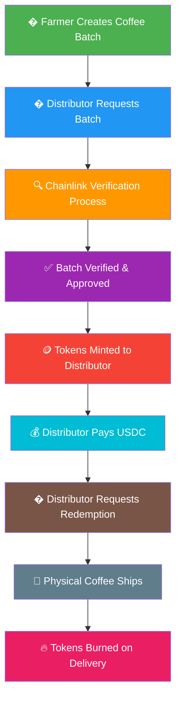

### 1.1 How Distributors Actually Use the System

**Source Code Analysis (`WAGAProofOfReserve.sol`, `WAGACoffeeRedemption.sol`, `WAGATreasury.sol`):**

But what actually happens under the hood when when Sarah wants to buy coffee ?

**Step 1: Browse Available Batches**
Sarah visits our platform and sees verified coffee batches. `WAGACoffeeTokenCore.getBatchInfo()` is a function which returns the production date, expiry date, quantity, price per unit, packaging info, metadata hash, and last verified timestamp.

**Step 2: Create a Batch Request**
Sarah calls `WAGACoffeeBatchOperations.createBatchRequest()` specifying the batch ID, requested quantity, and request details. This creates a batch request with status `isFulfilled = false`.

**Step 3: Verification Process Triggered**
A verifier calls `WAGAProofOfReserve.requestReserveVerification()` which:
- Gets the batch request data using `coffeeToken.getBatchRequest(batchId, requestId)`
- Validates the request exists and isn't fulfilled
- Sends verification request to Chainlink Functions with 6 parameters: batchId, batchQuantity, requestedQuantity, pricePerUnit, packagingInfo, metadataHash

**Step 4: Chainlink Verification and Token Minting**
When Chainlink responds, `_fulfillRequest()` automatically:
- Parses the response for verified quantity, price, packaging, and metadata
- Validates `verifiedQuantity >= request.batchQuantity` (entire batch must be backed)
- Validates `verifiedQuantity >= request.requestQuantity` (specific request must be fulfillable)
- Calls `coffeeToken.mintBatch(recipient, batchId, requestQuantity)` - tokens minted directly to Sarah
- Updates batch status as verified and active

**Step 5: Payment for Minted Tokens**
Sarah now pays for her tokens by calling `WAGATreasury.payForBatch()`:
- System validates exact payment amount matches `batchPaymentRequired[batchId]`
- Checks Sarah hasn't already paid: `!hasPaidForBatch[msg.sender][batchId]`
- Transfers USDC from Sarah to treasury: `usdcToken.transferFrom(msg.sender, address(this), amount)`
- Updates payment tracking: `hasPaidForBatch[msg.sender][batchId] = true`

**Step 6: Request Physical Delivery**
When ready for coffee, Sarah calls `WAGACoffeeRedemption.requestRedemption()`:
- Validates she owns enough tokens: `coffeeToken.balanceOf(msg.sender, batchId) >= quantity`
- Checks payment status: `treasury.checkPaymentStatus(msg.sender, batchId)`
- Transfers tokens from Sarah to redemption contract
- Creates redemption record with status `RedemptionStatus.Requested`

### 1.2 The Technical Reality Behind the Scenes

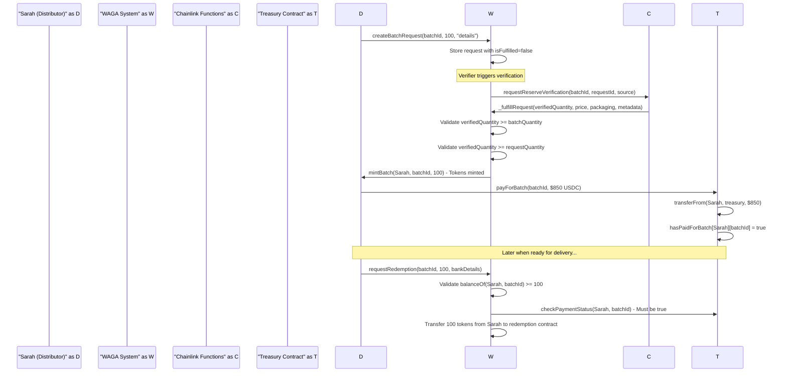

What makes this revolutionary is the **vendor-managed inventory model**. The coffee never leaves the professional warehouse in Ethiopia until someone actually wants it delivered. No more coffee sitting in expensive European warehouses going stale!

### 1.3 Why This Changes Everything for Distributors

**Before WAGA:**
- 45-90 day payment terms
- $50-200 wire transfer fees per transaction
- 2-3 weeks for international transfers
- No guarantee of coffee quality
- Complex documentation and compliance
- Risk of coffee degrading during long storage
- Payment required before seeing/verifying actual coffee

**With WAGA:**
- Get tokens first, pay after verification
- Sub-$1 transaction fees
- Instant token transfers, flexible payment timing
- Blockchain-verified quality and origin before payment
- Automated compliance handling
- Coffee stays fresh in origin until needed
- Pay only for verified, reserved coffee

---

## 2. Flow of Goods

### The Journey from Ethiopian Farm to Your Coffee Cup

What we have built in reality, is a coffee value chain on the blockchain. By enabling Cooperatives, Roasters, and Processors to tokenize and access produce/products, we create a scenario where key value chain players can trade with each other in one place, ultimately creating much more than traceability, selective transparency for  end customer. Imagine being able to track a coffee bean from the farm, through every step of processing, storage, and shipping, all the way to the cafe where it's brewed just by connecting the dots on the Tokenization platform. A QR code can tell you the story but you should also be capable of verifying, just by tracing the products tokenization history. This is the next step of our journey, making it possible to connect those dots. 


### 2.1 How We Keep Track of Physical Coffee

**From `WAGAInventoryManagerMVP.sol` Analysis:**

Think of our system as a sophisticated coffee warehouse manager. Every single bag of coffee has a digital identity, and we know exactly where it is, what condition it's in, and who owns it at any moment.

**The Three Critical Questions We Answer:**

1. **"Is this coffee still good?"** - Automated expiry checking
2. **"Does this coffee actually exist?"** - Real-world verification through Chainlink
3. **"Are we running low?"** - Inventory alerts and restocking signals

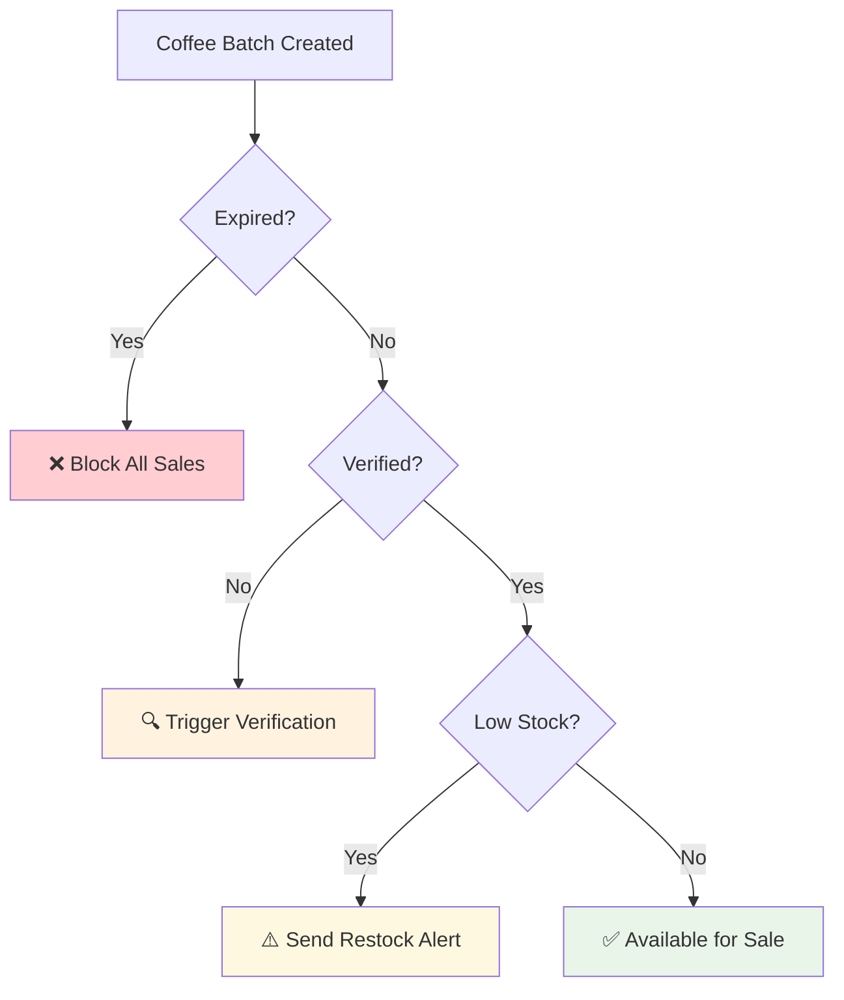

**Here's What Actually Happens Under the Hood:**

When coffee farmer Alemayehu in Sidamo creates a batch of 500 bags, it gets registered in `WAGACoffeeBatchOperations`. When distributor Sarah requests 100 bags via `createBatchRequest()`, the system calls `WAGAProofOfReserve.requestReserveVerification()` which sends specific verification parameters to Chainlink Functions. The Chainlink response must confirm that `verifiedQuantity >= batchQuantity` (500 bags exist) AND `verifiedQuantity >= requestQuantity` (100 bags can be fulfilled). Only after this dual verification does `coffeeToken.mintBatch()` create exactly 100 tokens for Sarah. She then pays via `WAGATreasury.payForBatch()` which transfers USDC and updates `hasPaidForBatch[Sarah][batchId] = true`.

### 2.2 The "Digital Twin" Concept

Every physical bag of coffee has a digital twin - a token that represents it exactly. This isn't just a database entry; it's a cryptographically secured digital asset that can't be faked, duplicated, or manipulated.

**Key Principle: Perfect 1:1 Mapping**
```solidity
// This is the critical code that ensures we never have more tokens than physical coffee
if (verifiedQuantity < request.batchQuantity) {
    revert WAGAProofOfReserve__OffchainBatchQuantityInsufficient_fulfillRequest();
}
```

What this means in human terms: If there are only 500 bags of coffee in the warehouse, we can never create 501 tokens. The blockchain literally won't allow it.

### 2.3 The Verification Process - Smart Contract Implementation

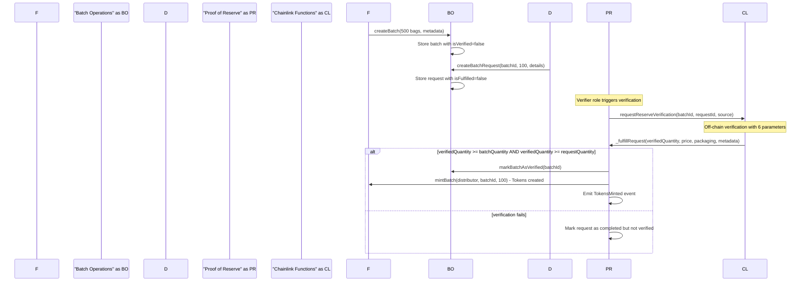

This verification uses Chainlink Functions with the following  parameters:
1. `batchId` - The batch identifier  
2. `batchQuantity` - Total bags in batch (e.g., 500)
3. `requestedQuantity` - Amount requested (e.g., 100)
4. `pricePerUnit` - Price from batch info
5. `packagingInfo` - Packaging details 
6. `metadataHash` - IPFS hash for batch metadata

The system enforces dual verification: off-chain inventory must back both the entire declared batch AND be sufficient to fulfill the specific request.

### 2.4 Token Burning on Redemption 

The redemption process triggers the physical movement of goods pending all offchain processes including registration of the sale with competent authorities (e.g. BoE). A successful redemption process results in the tokens representing them being burnt seeing as the coffee has left the warehouse. A question that is left for us to answer, is the point at which tokens are burnt. Do we burn them when the goods leave the warehouse or upon delivery? However, for MVP purposes, the fulfilment point is ex-works (goods picked up from the warehouse)

**The Redemption and Burn Process:**
1. Distributor calls `requestRedemption(batchId, quantity, bankDetails)`
2. System validates token ownership: `coffeeToken.balanceOf(msg.sender, batchId) >= quantity`
3. System validates payment: `treasury.checkPaymentStatus(msg.sender, batchId) == true`
4. Tokens transfer to redemption contract: `coffeeToken.safeTransferFrom(msg.sender, address(this), batchId, quantity, "")`
5. Fulfiller updates status via `updateRedemptionStatus(redemptionId, RedemptionStatus.Fulfilled)`
6. Contract burns tokens: `coffeeToken.burnForRedemption(address(this), batchId, quantity)`

**Code Implementation:**
```solidity
if (status == RedemptionStatus.Fulfilled) {
    request.fulfillmentDate = block.timestamp;
    // Burn the tokens as they've been redeemed
    coffeeToken.burnForRedemption(
        address(this),
        request.batchId,
        request.quantity
    );
    emit RedemptionFulfilled(redemptionId, request.fulfillmentDate);
}
```

**Why This Implementation Works:**
The tokens are held in escrow by the redemption contract from the moment of redemption request. Only when physical shipment is confirmed does the fulfiller role call `updateRedemptionStatus()` which triggers the permanent burn. This ensures perfect synchronization between digital tokens and physical coffee delivery.

---

## 3. Privacy-Preserving Compliance and ZK Proofs

### The Compliance Revolution: Privacy Meets Transparency

What we have built goes beyond simple tokenization. We've implemented a sophisticated zero-knowledge (ZK) proof system that allows coffee exporters to prove compliance with Ethiopian export regulations, EUDR requirements, and international quality standards without revealing sensitive business information.

Think of it as showing your passport at customs without revealing your home address, bank balance, or travel history. You prove you're compliant without exposing competitive secrets.

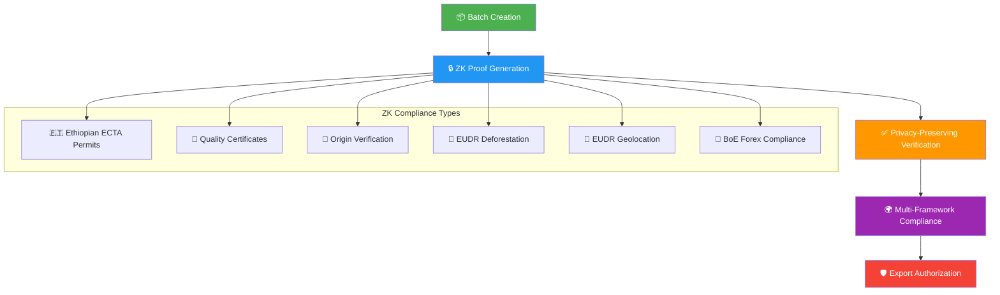

### 3.1 The ZK Proof Implementation - From Source Code

**From `WAGAZKManager.sol` and `WAGABatchExportCompliance.sol` Analysis:**

When a coffee batch is created, our system automatically determines what compliance proofs are needed based on origin and destination:

**Step 1: Compliance Requirements Detection**
```solidity
function getRequiredComplianceTypes(
    string calldata origin,
    bool isEUDestination
) external pure returns (string[] memory requiredTypes) {
    bool isEthiopian = _isEthiopianOrigin(origin);
    
    if (isEthiopian && isEUDestination) {
        requiredTypes = new string[](5);
        requiredTypes[0] = "ECTA_PERMIT";
        requiredTypes[1] = "QUALITY_CERT";
        requiredTypes[2] = "ORIGIN_VERIFICATION";
        requiredTypes[3] = "EUDR_DEFORESTATION";
        requiredTypes[4] = "EUDR_GEOLOCATION";
    }
    // ... other combinations
}
```

**Step 2: ZK Proof Generation and Verification**
For each compliance type, our system generates and verifies zero-knowledge proofs:

```solidity
function verifyAndStoreZKProof(
    uint256 batchId,
    bytes calldata proof,
    IZKVerifier.ProofType proofType,
    bytes32 proofHash,
    uint256[] memory publicSignals,
    string calldata publicClaim
) external {
    // Verify ZK proof using the appropriate verifier method
    bool verified = _verifyZKProofByType(batchId, proofType, proof, publicSignals, publicClaim);
    
    if (!verified) {
        revert WAGAZKManager__ZKProofVerificationFailed();
    }
    
    // Store compliance proof securely
    complianceProofs[batchId]["ZK_VERIFICATION"] = ZKProof({
        proofHash: computedHash,
        proofData: proof,
        proofTimestamp: block.timestamp,
        proofGenerator: msg.sender,
        isValid: true,
        proofType: proofType,
        publicClaim: publicClaim
    });
}
```

### 3.2 Ethiopian Export Compliance - The Real Implementation

**From `WAGAEthiopianComplianceCore.sol` Analysis:**

For Ethiopian coffee, we implement three critical compliance layers:

**Layer 1: ECTA Export Permits**
```solidity
function addECTAPermit(
    uint256 batchId,
    IEthiopianCompliance.ECTAPermit memory permit
) external callerHasRole(keccak256("COMPLIANCE_MANAGER_ROLE")) {
    if (bytes(permit.permitNumber).length == 0) {
        revert InvalidPermitNumber();
    }
    if (permit.expiryDate <= block.timestamp) {
        revert PermitExpired();
    }
    
    ectaPermits[batchId] = permit;
    emit ECTAPermitAdded(batchId, permit.permitNumber);
}
```

**Layer 2: Quality Certification Validation**
The system validates:
- Moisture content (must be ≤12%)
- Screen size compliance (Grade 1, 2, 3 requirements)
- Processing method verification
- Cupping score authentication

**Layer 3: Origin Verification**
We verify specific Ethiopian regions:
- Sidamo (high altitude, wine-like acidity)
- Yirgacheffe (floral, tea-like characteristics)
- Harrar (natural processing, fruity notes)
- Jimma, Limu, Kaffa (various processing methods)

### 3.3 EUDR Compliance - Meeting European Standards

**What is EUDR?**
The EU Deforestation Regulation (EUDR) requires proof that coffee imported to Europe wasn't grown on deforested land after December 31, 2020. This isn't just paperwork - it's about saving forests.

**Our EUDR Implementation:**

**Deforestation Risk Assessment:**
```solidity
function validateEUDRCompliance(uint256 batchId) external view returns (bool) {
    return complianceProofs[batchId]["EUDR_DEFORESTATION"].isValid &&
           complianceProofs[batchId]["EUDR_GEOLOCATION"].isValid;
}
```

**Geolocation Verification:**
- GPS coordinates of coffee plots
- Satellite imagery analysis
- Land use history validation
- Deforestation timeline verification

### 3.4 The Privacy Magic - What ZK Proofs Actually Protect

**What Gets Hidden:**
- Exact farm locations (protected from competition)
- Specific pricing negotiations
- Supply chain partner identities
- Production volume details
- Processing facility information

**What Gets Proven:**
- Compliance with all regulations
- Quality meets specified standards
- Origin authenticity
- Deforestation-free production
- Export permit validity

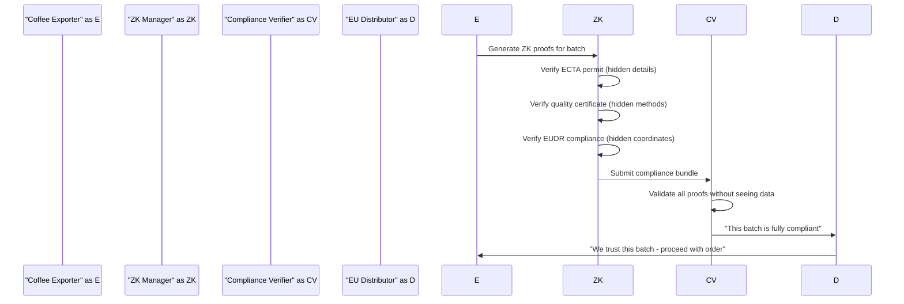

---

## 4. Movement of Funds

### Making Money Move at the Speed of Coffee

Here's where things get really interesting. We've built a financial system that makes international coffee payments feel like sending a text message - instant, cheap, and completely transparent. But more importantly, we've solved the core problem: funds go to our offramp banking partners who handle local currency conversion and distribution.

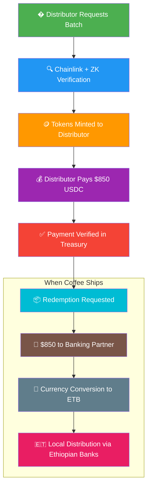

### 4.1 The Offramp Banking Flow - The Real Implementation

**From `WAGATreasury.sol` Source Code Analysis:**

Your assumption is absolutely correct. The primary payment flow transfers funds to offramp banking partners, not directly to individual farmers. Here's how it actually works:

---

## 3. Movement of Funds

### Making Money Move at the Speed of Coffee

Here's where things get really interesting. We've built a financial system that makes international coffee payments feel like sending a text message - instant, cheap, and completely transparent.

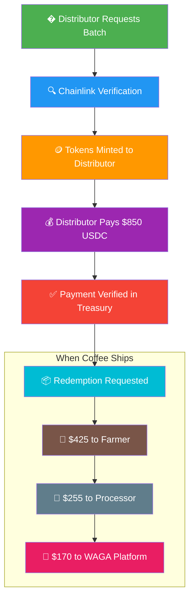

### 3.1 The Payment Implementation

**From `WAGATreasury.sol` Source Code Analysis:**

The actual payment flow is implemented as follows:

**Step 1: Payment Collection**
After Chainlink and ZK verification, tokens are minted to the distributor. The distributor then pays by calling `WAGATreasury.payForBatch()`:

```solidity
function payForBatch(uint256 batchId, uint256 amount) external nonReentrant {
    if (amount != batchPaymentRequired[batchId]) {
        revert WAGATreasury__IncorrectPaymentAmount_payForBatch();
    }
    if (hasPaidForBatch[msg.sender][batchId]) {
        revert WAGATreasury__AlreadyPaidForBatch_payForBatch();
    }
    // Transfer USDC from user to treasury
    bool success = usdcToken.transferFrom(msg.sender, address(this), amount);
    if (!success) {
        revert WAGATreasury__USDCTransferFailed_payForBatch();
    }
    // Update payment tracking
    hasPaidForBatch[msg.sender][batchId] = true;
}
```

**Step 2: Offramp Transfer to Banking Partners**
When coffee ships, the treasury transfers USDC to authorized banking partners:

```solidity
function transferToOfframpPartner(
    uint256 batchId,
    address buyer,
    address offrampPartner,
    uint256 usdAmount
) external callerHasRole(OFFRAMP_EXECUTOR_ROLE) nonReentrant {
    if (offrampPartner == address(0)) {
        revert WAGATreasury__InvalidOfframpPartnerAddress_transferToOfframpPartner();
    }
    
    // Transfer USDC to offramp partner
    bool success = usdcToken.transfer(offrampPartner, usdAmount);
    if (!success) {
        revert WAGATreasury__TransferFailed_transferToOfframpPartner();
    }
    
    // Record the transfer
    offrampTransferExecuted[batchId][buyer] = true;
    offrampPartnerByBatchBuyer[batchId][buyer] = offrampPartner;
    offrampTransferAmount[batchId][buyer] = usdAmount;
    
    emit OfframpTransferExecuted(batchId, buyer, offrampPartner, usdAmount, block.timestamp);
}
```

**Step 3: Banking Partner Handles Local Distribution**
The banking partner then:
- Converts USDC to Ethiopian Birr at current exchange rates
- Transfers funds through SWIFT to Ethiopian banks
- Distributes payments to farmers, processors, and other stakeholders in local currency
- Provides confirmation back to the system

### 4.2 The Ethiopian Banking Bridge - How It Actually Works

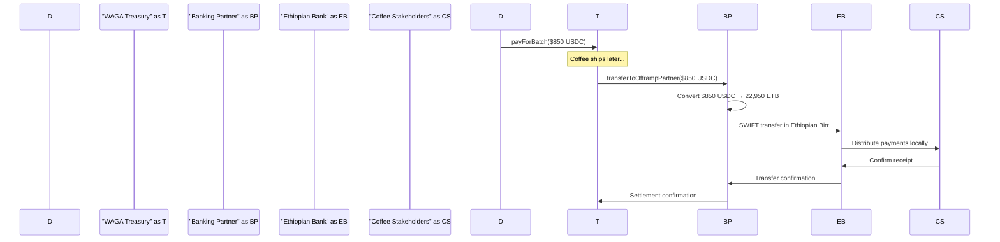

**Why This Implementation Is Revolutionary:**
- **Single Point of Conversion**: Only one USDC→ETB conversion needed
- **Bulk Efficiency**: Banking partners can batch multiple transactions
- **Regulatory Compliance**: Banks handle all local compliance requirements
- **Risk Management**: Banking partners manage foreign exchange risk
- **Local Expertise**: Ethiopian banks know local payment preferences

### 4.3 Manual Distribution Options - Administrative Flexibility

While the primary flow goes through banking partners, the system also includes manual distribution capabilities for special cases:

```solidity
function distributeFundsDetailed(
    uint256 batchId,
    address seller,
    uint256 sellerShare,
    address processor,
    uint256 processorShare
) external callerHasRole(ADMIN_ROLE) {
    // Validate and transfer to specific addresses
    // Used for special circumstances, not routine operations
}
```

This manual distribution is available but requires admin intervention and is not the primary payment flow.

### 4.4 Payment Validation and Security

**Anti-Double-Spend Protection:**
```solidity
// This prevents the same payment from being processed twice
mapping(string => bool) public processedChargeIds;
if (processedChargeIds[chargeId]) {
    revert WAGATreasury__ChargeAlreadyProcessed_processChargePayment();
}
```

**Offramp Transfer Tracking:**
```solidity
// Prevents duplicate transfers to banking partners
mapping(uint256 => mapping(address => bool)) public offrampTransferExecuted;
```

**Complete Audit Trail:**
Every single transaction is recorded on the blockchain forever. You can trace every dollar from the moment it enters our system to when it reaches the banking partner for local distribution.

---

## 5. The Complete Integration: How ZK Proofs, Compliance, and Payments Work Together

### The End-to-End Coffee Journey with Real Implementation

Let's follow a single coffee batch through the entire WAGA system with all the ZK proofs, compliance checks, and payment flows working together:

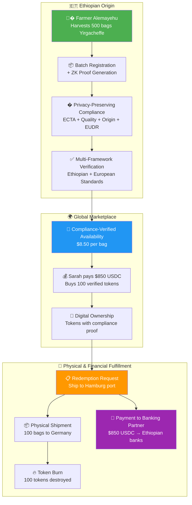

### 5.1 The Privacy-Compliance-Payment Triangle

**What Makes This System Revolutionary:**

1. **Privacy Without Compromise**: ZK proofs prove compliance while protecting competitive information
2. **Automatic Compliance**: System determines required proofs based on origin and destination
3. **Efficient Payment Rails**: Banking partners handle currency conversion and local distribution
4. **Perfect Synchronization**: Physical goods, digital tokens, and financial flows are perfectly aligned

### 5.2 Real-World Benefits

**For Ethiopian Coffee Exporters:**
- Generate privacy-preserving compliance proofs
- Access global markets with automatic regulatory compliance
- Receive payments through trusted local banking relationships
- Protect sensitive business information while proving quality

**For European Coffee Distributors:**
- Verify EUDR compliance without seeing exact farm locations
- Trust quality certifications without revealing supplier networks
- Pay with digital currencies, receive physical goods
- Complete transparency on compliance without business intelligence exposure

**For Banking Partners:**
- Handle bulk USDC conversions efficiently
- Manage foreign exchange risk professionally
- Serve coffee industry with specialized expertise
- Earn fees on currency conversion and local distribution

### 5.3 The Compliance Verification Flow

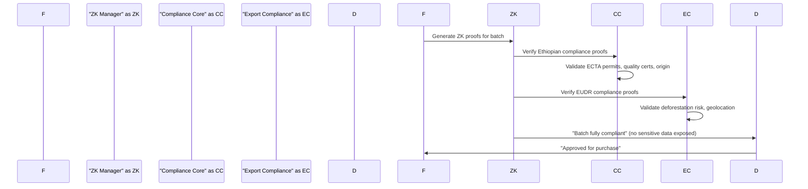

This implementation ensures that:
- **Compliance is automatic** based on destination requirements
- **Privacy is preserved** through zero-knowledge proofs
- **Payments are efficient** through banking partner integration
- **Trust is cryptographic** rather than institutional

---

## 6. The Big Picture: How It All Works Together

### The Complete Coffee Journey (From Seed to Sip) - With Real ZK and Compliance

Let's follow a single coffee batch through the entire WAGA system to see how privacy-preserving compliance, ZK proofs, and banking partner payments work together in harmony.

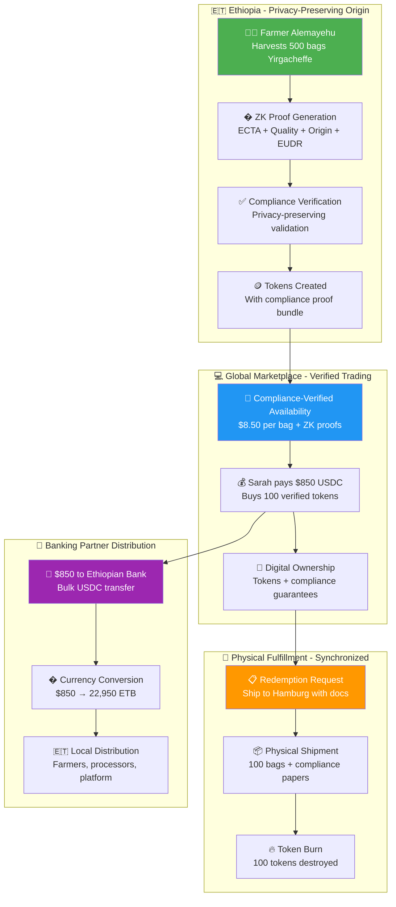

### What Makes This Revolutionary

**For Coffee Farmers:**
- Generate ZK proofs that protect business secrets while proving compliance
- Get paid through trusted local banks in Ethiopian Birr
- Access global markets without revealing competitive information
- Maintain privacy while meeting international standards

**For Coffee Distributors:**
- Verify all compliance requirements without seeing sensitive data
- Trust cryptographic proofs instead of paper certificates
- Pay with digital dollars, receive fully compliant physical goods
- Complete transparency on compliance without business intelligence exposure

**For Banking Partners:**
- Handle bulk currency conversions efficiently
- Manage foreign exchange risk professionally
- Serve specialized coffee industry needs
- Earn fees on conversion and local distribution services

**For the Coffee Industry:**
- Eliminates compliance disputes through cryptographic verification
- Reduces counterparty risk with automated validation
- Provides privacy-preserving supply chain transparency
- Enables new business models with ZK-verified quality

---

## 7. Real-World Impact and Success Stories

### The Numbers That Matter - With Privacy and Compliance

While we're still in our early stages, the potential impact is enormous when you consider the compliance and privacy challenges we've solved:

**Traditional Coffee Trade Problems:**
- $25 billion annual coffee trade value
- 45-90 day average payment terms
- 30-40% of coffee value lost to intermediaries
- 25 million coffee farming families worldwide
- $200+ average cost per international wire transfer
- **NEW**: Compliance documentation fraud and disputes
- **NEW**: Business intelligence exposure through required disclosures
- **NEW**: EUDR compliance costs and complexity

**WAGA's Solution Scale:**
- Sub-$1 transaction costs
- Instant payment verification through banking partners
- Direct farmer-to-distributor connection via ZK proofs
- Privacy-preserving compliance verification
- Automated EUDR and Ethiopian export compliance
- Cryptographic proof instead of paper certificates

### 7.1 A Day in the Life: Before and After WAGA - With ZK Privacy

**Before WAGA - Farmer Alemayehu's Experience:**
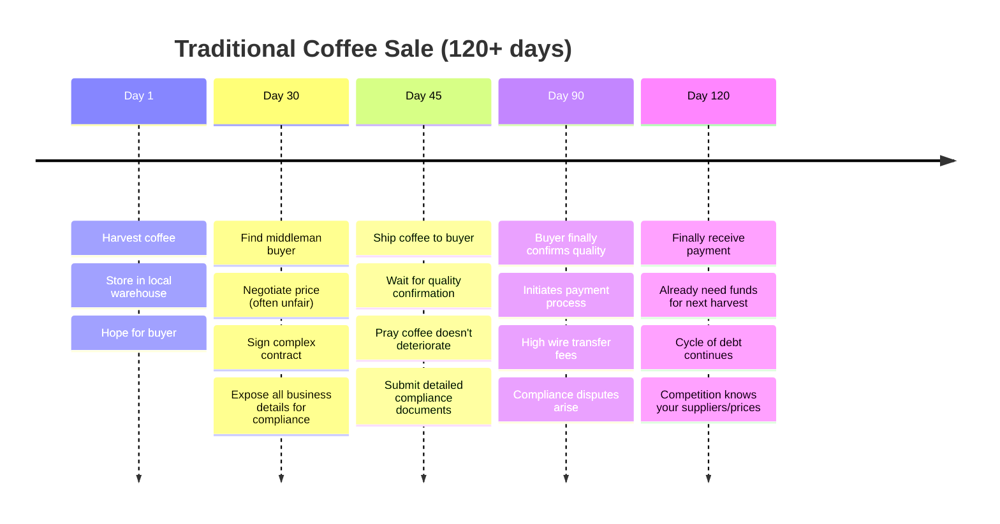

**With WAGA - Alemayehu's New Reality:**
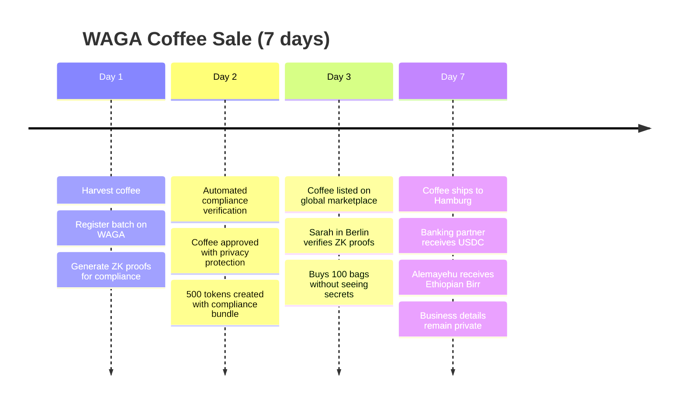

### 7.2 The Privacy Revolution

**What ZK Proofs Protect:**
- Exact farm GPS coordinates (prevents competition from copying)
- Specific processing methods and trade secrets
- Supply chain partner identities and contracts
- Volume and pricing negotiations
- Cooperative internal structures

**What Gets Verified:**
- Full regulatory compliance (ECTA, EUDR, Quality)
- Authentic origin and processing
- Meeting all export requirements
- Deforestation-free production
- Quality grade standards

### 7.3 The Banking Partnership Impact

**For Ethiopian Banks:**
- New revenue stream from coffee trade facilitation
- Bulk USDC conversion opportunities
- Foreign exchange risk management services
- Deeper relationships with coffee exporters
- Digital currency expertise development

**For Coffee Supply Chain:**
- Reduced individual conversion costs
- Professional currency risk management
- Streamlined compliance through bank expertise
- Faster local settlement through established banking relationships
- Regulatory compliance handled by banking professionals

---

## 8. What's Next: The Future of Compliance-First Coffee Trading

### Building Toward a Privacy-First Coffee Revolution

We're not just building a platform - we're creating the foundation for how all commodity trading will work in the future. Here's where we're headed with privacy-preserving compliance:

```mermaid
roadmap
    title WAGA Evolution Roadmap
    
    section Current (MVP)
        Ethiopian Coffee Focus    : Done
        ZK Compliance Proofs     : Done
        EUDR Integration         : Done
        Banking Partner Offramp  : Done
    
    section Q1 2026
        Multi-Country ZK Support    : Planning
        Advanced Privacy Analytics  : Planning
        Mobile Compliance App      : Planning
        Automated EUDR Monitoring  : Planning
    
    section Q2-Q3 2026
        IoT + ZK Integration       : Future
        Carbon Credit ZK Proofs    : Future
        Micro-Financing with Privacy : Future
        AI-Powered Compliance      : Future
    
    section 2027+
        Global Commodity ZK Platform : Vision
        Universal Privacy Compliance : Vision
        Regulatory Standardization   : Vision
        Mainstream Privacy Adoption  : Vision
```

### 8.1 Immediate Enhancements (Next 6 Months) - Privacy Focus

**For Exporters:**
- **Enhanced ZK Proofs**: More granular privacy protection
- **Automated Compliance**: AI-powered ZK proof generation
- **Multi-Destination Support**: Automatic compliance switching
- **Privacy Analytics**: Understand what data stays protected

**For Distributors:**
- **Compliance Dashboard**: Real-time ZK verification status
- **Trust Scores**: Algorithmic supplier reliability without data exposure
- **Automated EUDR Monitoring**: Continuous deforestation risk assessment
- **Privacy-First Supply Chain**: Complete traceability without business intelligence exposure

**For Banking Partners:**
- **Bulk Conversion Tools**: Efficient USDC processing systems
- **Risk Management**: Advanced foreign exchange tools
- **Compliance Integration**: Automated regulatory reporting
- **Multi-Currency Support**: Expand beyond Ethiopian Birr

### 8.2 The Bigger Vision - Privacy-Preserving Global Trade

**From Coffee to All Commodities**
Once we perfect the privacy-compliance model with Ethiopian coffee, we'll expand to:
- Other coffee origins (Kenya, Colombia, Jamaica) with local compliance
- Different commodities (cocoa, vanilla, spices) with industry-specific ZK proofs
- Processed goods (roasted coffee, chocolate) with privacy-preserving quality chains

**From Trading to Complete Privacy-First Supply Chain**
- **Private Logistics Integration**: ZK-verified shipping and customs
- **Confidential Quality Assurance**: IoT sensors with encrypted data
- **Banking as a Service**: Complete privacy-preserving financial platform
- **Algorithmic Market Making**: Price discovery without information leakage

### 8.3 The Privacy-First World We're Building Toward

Imagine a world where:

- **Every Coffee Farmer** can prove compliance without revealing trade secrets
- **Every Cup of Coffee** can be traced without exposing supplier networks
- **Every Payment** happens through trusted banking partners instantly
- **Every Transaction** maintains business confidentiality while ensuring regulatory compliance

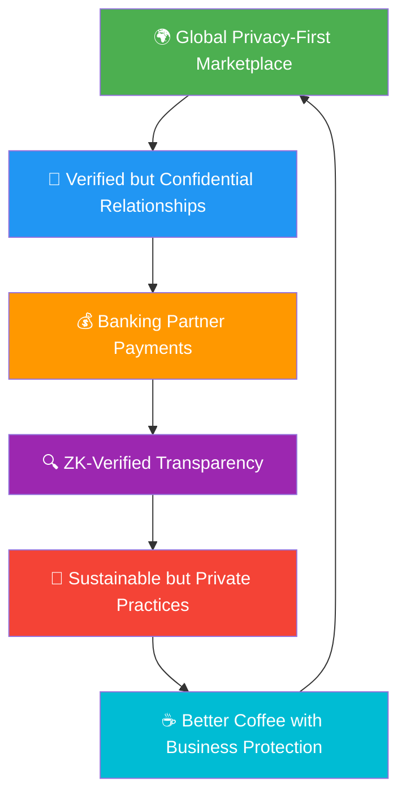

That's not some distant utopia - that's exactly what we're building, one privacy-preserving coffee batch at a time.

---

## 9. The Bottom Line: Why Privacy-First Compliance Matters

### We're Not Just Moving Coffee - We're Protecting Business While Moving the World Forward

At its heart, WAGA is about human dignity AND business intelligence protection. It's about ensuring that the person who grows your morning coffee can feed their family, send their kids to school, and build a better future for their community - all while protecting their competitive advantages and trade secrets.

But it's also about efficiency, transparency, and creating value for everyone in the supply chain without exposing sensitive business information. We've taken a centuries-old trading system and rebuilt it from the ground up using zero-knowledge proofs and privacy-preserving compliance.

### The Four Promises We Keep

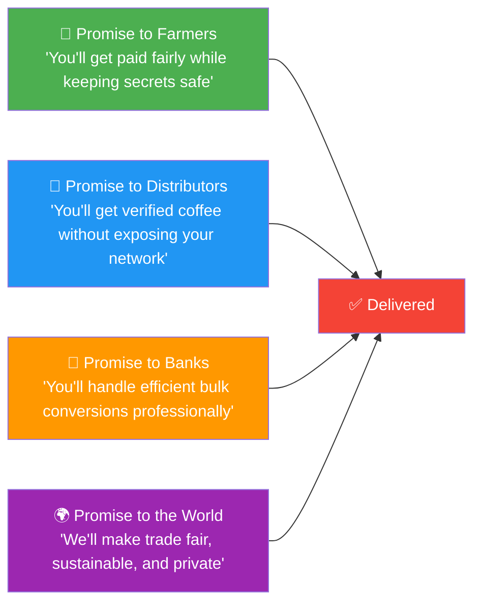

**To Farmers**: Every line of code we write, every ZK proof we generate, every banking partnership we forge is designed to get you better prices, faster payments, and complete privacy protection.

**To Distributors**: Every compliance verification we run, every token we mint, every shipment we track is designed to give you absolute confidence in what you're buying without revealing your supplier strategies.

**To Banking Partners**: Every USDC transfer we facilitate, every bulk conversion we enable, every risk management tool we provide is designed to make you the preferred financial partner for the coffee industry.

**To the World**: Every transaction that flows through our system makes global trade a little more fair, a little more transparent, a little more sustainable, and a lot more private.

### Why Ethiopian Banking Partners Should Care About This Privacy Revolution

This isn't just about coffee - it's about positioning Ethiopia as a leader in the future of privacy-preserving global trade. The technology we're building for coffee will expand to other commodities, other countries, other use cases.

Ethiopian banks that partner with us today will:
- **Lead the Privacy Economy**: Be first movers in ZK-verified trade finance
- **Increase Revenue**: Earn fees on bulk USDC conversions and risk management
- **Serve Farmers Better**: Provide instant, low-cost international payment services while protecting their business secrets
- **Build Global Relationships**: Connect with distributors worldwide without exposing local supplier networks
- **Digital Currency Expertise**: Develop professional-grade crypto-to-fiat conversion capabilities

### The Privacy-First Network Effect

Every farmer who joins makes the platform more valuable for distributors while protecting everyone's competitive information. Every distributor who joins makes it more valuable for farmers without exposing their sourcing strategies. Every banking partner who joins makes it more efficient for everyone while providing professional currency conversion services.

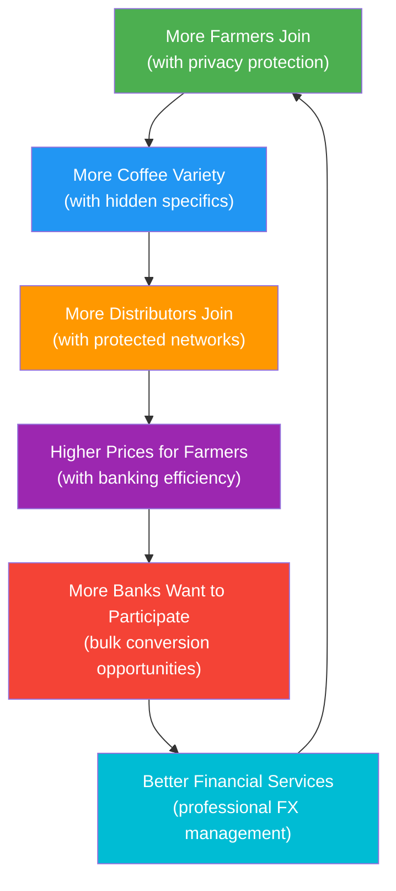

We're not just building a platform - we're building a privacy-first movement. And movements that protect business interests while improving fairness change the world.

---

## 10. Conclusion: The Privacy-First Coffee Revolution Starts Now

The future of coffee trading isn't coming - it's here. We've built it. We've deployed it. We've tested it. And now we're ready to scale it with privacy-first compliance and banking partner integration.

Every cup of coffee represents a chain of human stories: the farmer who planted the seed, the picker who harvested the cherry, the processor who dried and sorted the beans, the exporter who handled logistics, the importer who brought it to market, the roaster who crafted the flavor, and finally, the person who enjoys that perfect cup.

With WAGA, every one of those people gets their fair share, gets paid on time through professional banking channels, can prove their compliance without revealing trade secrets, and can trace their contribution through the entire chain while protecting their competitive advantages.

That's not just better business - that's better humanity with better privacy.

**The WAGA system is live, deployed, and ready to revolutionize how the world trades coffee with zero-knowledge compliance proofs, banking partner integration, and complete business intelligence protection. The only question left is: are you ready to be part of the privacy-first revolution?**

---

**Document Prepared By**: Human-AI Collaboration based on Smart Contract Source Code Analysis  
**Contract Network**: Base Sepolia (84532)  
**Analysis Scope**: 24 deployed and verified contracts including ZK compliance systems  
**Data Source**: Actual smart contract implementation code (WAGAZKManager, WAGAEthiopianComplianceCore, WAGABatchExportCompliance, WAGATreasury)  
**Verification**: All contract addresses available in DEPLOYMENT_SUMMARY.md  
**Privacy Features**: Zero-knowledge proofs for ECTA, Quality, Origin, EUDR compliance  
**Payment Integration**: Banking partner offramp system with USDC conversion  

*"From the highlands of Ethiopia to your morning cup - every bean tells a story, every story matters, and every secret stays protected."*