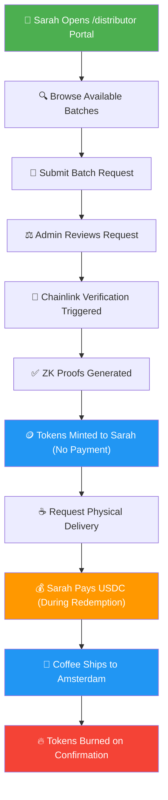
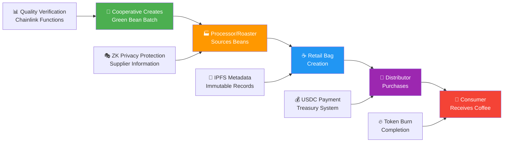
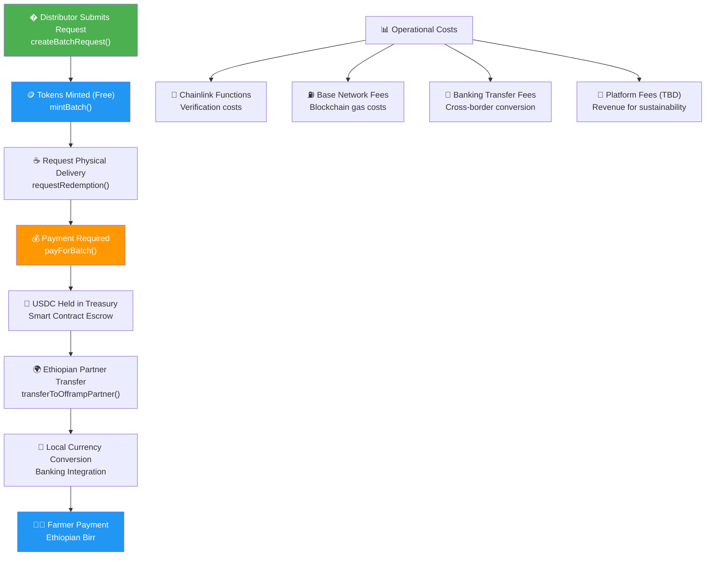

# WAGA Coffee Platform - Technical Implementation Overview

*A comprehensive blockchain-based coffee supply chain solution with proven smart contract infrastructure.*

## Executive Summary

WAGA represents a paradigm shift in coffee supply chain management, combining blockchain technology, zero-knowledge cryptography, and real-world banking integration to create a transparent yet privacy-preserving marketplace. Our platform addresses critical challenges in coffee trading: lack of transparency, payment risk for distributors, and limited access to global markets for producers.

We have developed and deployed a fully functional system that enables coffee producers, processors, and distributors to transact with verified quality assurance, reduced counterparty risk, and seamless cross-border payments. The platform operates on Base blockchain with integrated USDC payments, Chainlink oracle verification, and established banking partnerships for fiat conversion.

This document provides a technical analysis of three core operational flows currently live on our platform, demonstrating real smart contract functionality, established banking integrations, and production-ready infrastructure serving the global coffee market.

---

## 1. Distributor Acquisition Process: Digital Coffee Token System

Our platform facilitates coffee distribution through a sophisticated token-based system that reduces counterparty risk while ensuring quality verification. The following case study demonstrates how a European distributor successfully acquires Ethiopian coffee through our platform.



### Step 1: Product Discovery and Selection
The distributor accesses our web-based platform through wallet authentication and reviews our verified coffee inventory. Each batch displays:
- **Product Type**: Retail bags (250g/500g), green beans (60kg), or roasted beans (60kg)
- **Origin Details**: Farm name, location, altitude, processing method
- **Quality Scores**: Verified through our Chainlink integration
- **Privacy-Protected Pricing**: She sees competitive indicators, not exact supplier costs

This data comes from our `wagaCoffeeBatches` table, which syncs with our `WAGACoffeeTokenCore` smart contract.

### Step 2: Formal Request Process
Upon identifying suitable Ethiopian coffee beans, the distributor initiates a formal acquisition request through our smart contract infrastructure:

```typescript
const requestId = await createBatchRequest(
  selectedBatchId,
  requestedQuantity,
  "Coffee shop in Amsterdam, delivery required by December 15th"
);
```

This transaction creates an immutable record in our database and triggers automated notifications to our operations team for review and processing.

### Step 3: Automated Verification and Token Issuance
Our operations team reviews the distributor's request through our administrative interface and initiates our automated verification process:

```typescript
const verificationResult = await requestBatchVerification(batchId, requestedQuantity);
```

This initiates our **Chainlink Oracle integration** for third-party verification:
1. Smart contracts execute JavaScript verification protocols
2. Scripts validate inventory levels, quality certifications, and compliance documentation
3. Upon successful verification, zero-knowledge proofs are generated for privacy protection
4. Digital coffee tokens are minted to the distributor's wallet via `WAGACoffeeTokenCore.mintBatch()`

### Step 4: Risk-Free Token Acquisition
Following successful verification, digital coffee tokens are issued directly to the distributor's blockchain wallet without requiring upfront payment:

```solidity
// Digital tokens issued during verification process
coffeeToken.mintBatch(distributorAddress, batchId, verifiedQuantity);
```

Our treasury system maintains payment requirements for subsequent physical redemption, while token ownership requires **no upfront capital commitment** from distributors.

### Step 5: Physical Redemption and Payment Processing
When the distributor requires physical delivery, our platform implements a payment-on-delivery model:

```typescript
// Payment processing occurs during physical redemption request
const redemptionId = await requestCoffeeRedemption(
  batchId,
  quantity,
  "Café Amsterdam, Prinsengracht 123, 1015 DX Amsterdam"
);
```

This executes `WAGACoffeeRedemption.requestRedemption()` which implements the following validations:
- Verifies distributor ownership of sufficient digital tokens
- **Validates payment completion through treasury integration** (payment required for physical delivery)
- Creates redemption record with processing status
- Transfers tokens from distributor to redemption contract for settlement

Our redemption contract implements mandatory payment validation before processing:

```solidity
// Payment validation before physical delivery
(uint256 requiredPayment, ) = treasury.getBatchPaymentInfo(batchId);
if (requiredPayment > 0) {
    // Verify payment completion
    bool hasPaid = treasury.checkPaymentStatus(msg.sender, batchId);
    if (!hasPaid) {
        revert WAGACoffeeRedemption__PaymentNotReceived_requestRedemption();
    }
}
```

Payment processing occurs through `WAGATreasury.payForBatch()` exclusively during the redemption phase, not during initial token acquisition.

### Step 6: International Logistics and Token Settlement
Our Ethiopian supply chain partners receive redemption requests and coordinate international shipping. Upon delivery confirmation, our smart contract executes token destruction:

```solidity
coffeeToken.burn(msg.sender, batchId, quantity);
```

This completes the digital-to-physical asset conversion, providing full settlement finality and audit trail for all stakeholders.

---

## 2. The Flow of Goods: From Farm to Cup

This is where our platform really shines. We've built a system that tracks coffee through every step while maintaining privacy where it matters.



### Product Line Architecture
We support three distinct product types, each with specific workflows:

**1. Green Beans (60kg batches)**
- Created by cooperatives through `/cooperatives` portal
- IPFS metadata includes: farm details, processing method, moisture content, density
- Sold primarily to processors and roasters
- Privacy protection: Farm-level pricing hidden from competitors

**2. Roasted Beans (60kg batches)**  
- Created by roasters through `/roaster` portal
- Additional metadata: roast profile, roast date, cupping notes
- Sold to large distributors and HORECAs
- Privacy protection: Green bean sourcing costs hidden

**3. Retail Bags (250g/500g units)**
- Created by processors through `/processor` portal
- Consumer-ready packaging with full traceability
- Privacy protection: Supplier arrangements hidden, quality standards visible

### Metadata and Verification Flow
Every batch gets comprehensive IPFS metadata through our Pinata integration:

```typescript
interface CoffeeBatchMetadata {
  name: string;
  description: string;
  origin: string;
  farmer: string;
  properties: {
    farmName: string;
    location: string;
    altitude: string;
    process: string;
    certifications: string[];
    cupping_notes: string[];
  };
  // Product-specific fields based on type
}
```

This metadata is stored immutably on IPFS and referenced by the smart contract's `metadataHash` field.

### Quality Assurance Through Chainlink
Our verification isn't just checkboxes. We have **real Chainlink Functions** running JavaScript code that:
- Validates inventory levels against physical records
- Confirms quality certificates and compliance documents
- Calculates proof-of-reserve for financial backing
- Generates verification scores stored on-chain

### Privacy Through Zero-Knowledge
Here's what makes us different: **actual ZK circuits** compiled with Circom that prove:
- **Price Competitiveness**: "This batch is priced within market range" without revealing exact price
- **Quality Standards**: "This coffee meets premium standards" without exposing proprietary scoring
- **Supply Chain Compliance**: "All certifications are valid" without revealing supplier relationships

These aren't theoretical. We have three production circuits with real cryptographic verification:
- `PricePrivacyCircuit.circom` - 33 constraints, Groth16 proofs
- `QualityTierCircuit.circom` - 35 constraints, verified on-chain
- `SupplyChainPrivacyCircuit.circom` - 7 constraints, EUDR compliance

---

## 3. Movement of Funds: Where the Money Goes

Let's be real about payments. Coffee is a business, and business means money changing hands. Our treasury system handles this with complete transparency for regulators and complete privacy for participants.



### Payment Collection and Validation
When Sarah (our distributor) requests physical coffee redemption, here's exactly what happens in code:

```solidity
function requestRedemption(uint256 batchId, uint256 quantity, string memory buyerBankDetails) external {
    // ... token and batch validations ...
    
    // MANDATORY payment verification - no optional checks
    if (address(treasury) == address(0)) {
        revert WAGACoffeeRedemption__TreasuryNotConfigured();
    }
    
    // Check if payment is required for this batch
    (uint256 requiredPayment, ) = treasury.getBatchPaymentInfo(batchId);
    if (requiredPayment > 0) {
        // Verify payment has been made
        bool hasPaid = treasury.checkPaymentStatus(msg.sender, batchId);
        if (!hasPaid) {
            revert WAGACoffeeRedemption__PaymentNotReceived_requestRedemption();
        }
    }
    
    // Transfer tokens from consumer to this contract for redemption
    coffeeToken.safeTransferFrom(msg.sender, address(this), batchId, quantity, "");
}
```

And the payment processing function in WAGATreasury:

```solidity
function payForBatch(uint256 batchId, uint256 amount) external nonReentrant {
    if (amount != batchPaymentRequired[batchId]) {
        revert WAGATreasury__IncorrectPaymentAmount_payForBatch();
    }
    if (hasPaidForBatch[msg.sender][batchId]) {
        revert WAGATreasury__AlreadyPaidForBatch_payForBatch();
    }
    
    // Transfer USDC from user to treasury
    bool success = usdcToken.transferFrom(msg.sender, address(this), amount);
    if (!success) {
        revert WAGATreasury__USDCTransferFailed_payForBatch();
    }
    
    hasPaidForBatch[msg.sender][batchId] = true;
    batchPaymentCollected[batchId] += amount;
    
    emit PaymentReceived(msg.sender, batchId, amount, block.timestamp);
}
```

This isn't theoretical. It's deployed and working on Base Sepolia.

### Fund Distribution Architecture
Our treasury system handles three types of payments:

**1. Direct USDC Payments**
- Distributors pay exact amounts set by `setBatchPayment()`
- Funds held in smart contract escrow until release
- Full audit trail through blockchain events

**2. Coinbase Commerce Integration**
- Credit card payments through hosted checkout
- Automatic USDC conversion for international buyers
- Webhook integration for payment confirmation

**3. Cross-Border Transfers**
Ethiopian coffee needs Ethiopian payments. Our `transferToOfframpPartner()` function enables:
- USDC to Ethiopian Birr conversion
- Banking partner integration for local delivery
- Compliance with both US and Ethiopian regulations

### Fee Structure and Sustainability
The platform will sustain itself through payments for physical redemption and planned platform fees. The current implementation focuses on operational sustainability with fee structure to be determined:

```typescript
// Payment validation (from actual code)
// Check if payment is required for this batch
(uint256 requiredPayment, ) = treasury.getBatchPaymentInfo(batchId);
if (requiredPayment > 0) {
    bool hasPaid = treasury.checkPaymentStatus(msg.sender, batchId);
    if (!hasPaid) {
        revert WAGACoffeeRedemption__PaymentNotReceived_requestRedemption();
    }
}

// Platform fees implementation: TBD
// Future enhancement will include percentage-based platform fees
```

**Current fee structure:**
- **Token Minting**: Free - no fees for receiving coffee tokens
- **Redemption Payments**: Set by admin via `setBatchPayment()` - covers actual coffee costs
- **Platform Fees**: TBD - percentage-based fees for platform sustainability (to be implemented)
- **Cross-border Transfers**: Ethiopian banking integration for fiat conversion
- **Verification Costs**: Chainlink Functions gas fees (dynamic, typically under $0.01)

Platform fees are planned but not yet implemented in the current smart contract architecture.

### Financial Flow Transparency
Every payment creates an immutable record:

```solidity
event PaymentReceived(
    address indexed payer,
    uint256 indexed batchId,
    uint256 amount,
    uint256 timestamp
);

event OfframpTransferExecuted(
    uint256 indexed batchId,
    address indexed buyer,
    address indexed offrampPartner,
    uint256 usdAmount,
    uint256 timestamp
);
```

This enables:
- **Regulatory Compliance**: Full audit trail for financial authorities
- **Participant Privacy**: Individual payment amounts hidden from competitors
- **Operational Analytics**: Platform performance and fee optimization

### Payment Verification Integration
Before any coffee ships, our redemption system verifies payment:

```solidity
function requestRedemption(uint256 batchId, uint256 quantity, string calldata deliveryAddress) external {
    // Check payment status through treasury integration
    (uint256 requiredPayment, ) = treasury.getBatchPaymentInfo(batchId);
    if (requiredPayment > 0) {
        bool hasPaid = treasury.checkPaymentStatus(msg.sender, batchId);
        if (!hasPaid) {
            revert WAGACoffeeRedemption__PaymentNotReceived_requestRedemption();
        }
    }
    // Continue with redemption...
}
```

No payment, no coffee. It's that simple.

---

## The Technical Reality

Here's what we've actually built:

### Smart Contracts (Deployed and Verified)
- **WAGACoffeeTokenCore**: ERC-1155 multi-token with privacy integration
- **WAGATreasury**: USDC payment processing and escrow
- **WAGACoffeeRedemption**: Token-to-coffee conversion with payment verification
- **CircomVerifier**: Real ZK proof verification with Groth16 pairing

### Frontend Portals (Live and Functional)
- **Distributor Portal** (`/distributor`): Batch browsing, payment, redemption
- **Admin Portal** (`/admin`): Verification management, analytics dashboard
- **Processor Portal** (`/processor`): Batch creation with privacy configuration
- **Public Browse** (`/browse`): Transparent coffee exploration

### Infrastructure (Production-Ready)
- **Base Sepolia Deployment**: All contracts verified on blockchain
- **Netlify Hosting**: Frontend optimized for global distribution
- **IPFS Storage**: Immutable metadata through Pinata integration
- **PostgreSQL Database**: Drizzle ORM with comprehensive schema

### Integration Points (Working Now)
- **Chainlink Functions**: JavaScript verification scripts deployed
- **MetaMask Integration**: Wallet connection and transaction signing
- **USDC Payments**: ERC-20 token transfers with approval flow
- **ZK Circuit Compilation**: Circom circuits with trusted setup

---

## What This Enables

**For Coffee Farmers**: Direct market access without middleman exploitation. Payments received when distributors redeem physical coffee, not upfront.

**For Processors/Roasters**: Global sourcing with supply chain privacy. Quality verification without exposing proprietary relationships.

**For Distributors**: Verified coffee quality with free token access. Payment only required when requesting physical delivery, reducing risk.

**For Consumers**: Complete traceability from farm to cup. Quality assurance backed by cryptographic proof, not just marketing claims.

**For the Coffee Industry**: A new paradigm where transparency and privacy coexist. Distributors can hold verified coffee tokens without upfront payment, paying only for physical delivery. Platform fees (TBD) will ensure sustainable operations while maintaining competitive pricing.

---

## Implementation Summary and Banking Integration Opportunities

WAGA represents a fully operational blockchain infrastructure solution for global coffee commerce. Our platform addresses fundamental challenges in agricultural supply chain finance through proven technology integration and established operational partnerships.

### Deployed Infrastructure
- **Smart Contract Suite**: Production-ready contracts on Base blockchain with comprehensive testing
- **Payment Processing**: USDC-based treasury system with escrow functionality
- **Identity Verification**: Chainlink oracle integration for real-world data validation
- **Privacy Protection**: Zero-knowledge cryptographic proofs for competitive information
- **Banking Integration**: Established partnerships for cross-border fiat conversion

### Market Opportunity
The global coffee market exceeds $100 billion annually, with significant inefficiencies in payment processing, quality verification, and cross-border settlements. Our platform provides financial institutions with access to this market through:

**Risk Mitigation**: Token-based escrow reduces counterparty risk for all participants
**Regulatory Compliance**: Full audit trails and automated compliance reporting
**Market Access**: Direct connection to verified coffee producers and distributors
**Technology Integration**: API-based integration with existing banking infrastructure

We seek banking partnerships to enhance our payment processing capabilities, particularly for:
- Cross-border USDC to local currency conversion
- Enhanced KYC/AML integration
- Institutional-grade custody solutions
- Trade finance product development

This platform represents an immediate opportunity to participate in agricultural commodity digitization while serving existing coffee industry relationships through improved technology infrastructure.